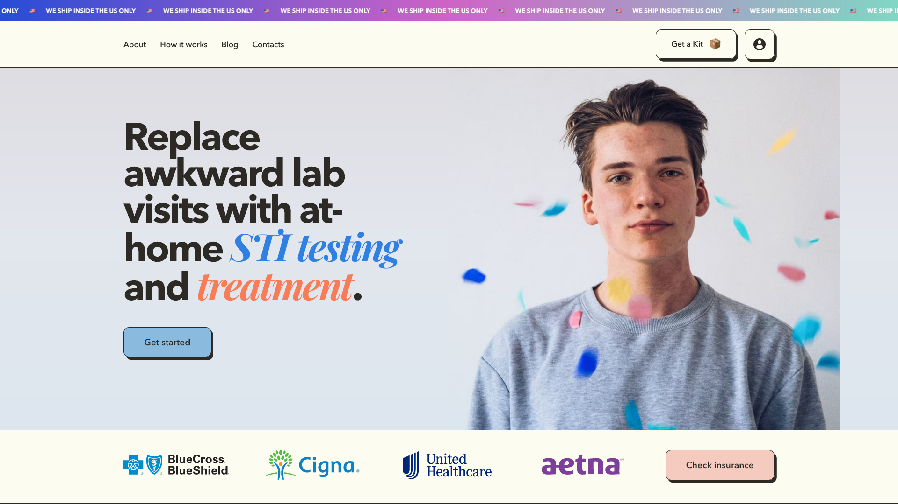
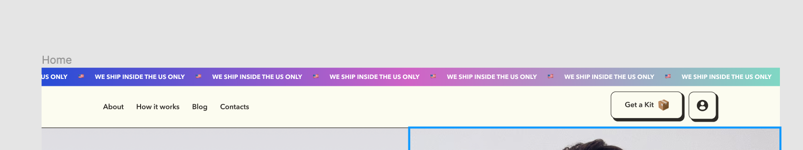
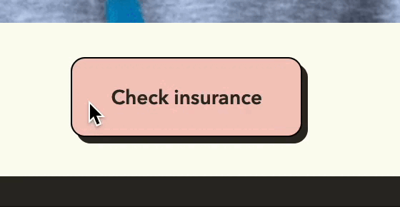
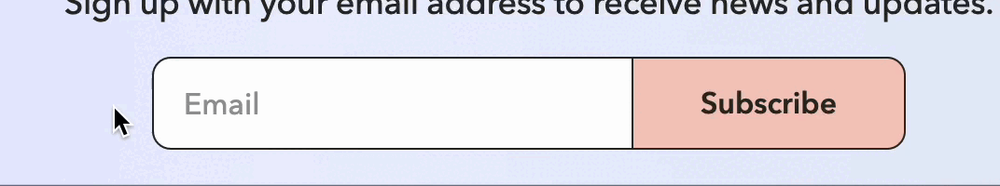
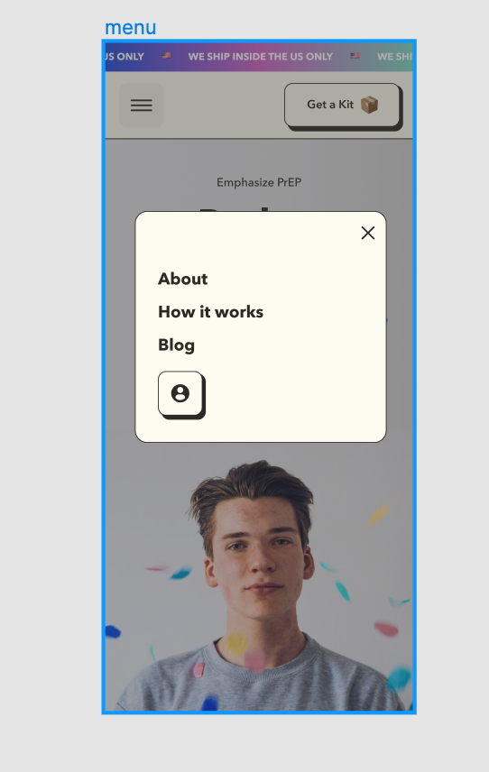

# easy-healthcare-kit

## Options
- Valid markup;
- Mobile friendly;
- Accessibility (the ability to navigate the site using the keyboard);
- Scss preprocessor is used;
- Vanilla Javascript is used;
- The front-end tool Gulp was used;
- Link to the expanded project: https://deysan.github.io/easy-healthcare-kit/

## Description
1. The running line moves smoothly\

2. Header is fixed\

3. Links have a hover and focus effect\

4. Buttons have a hover and focus effect\

5. Scrolling sections have an effect\

6. Input has focus effect, button should have hover effect and focus\

7. Mobile version of the menu\

